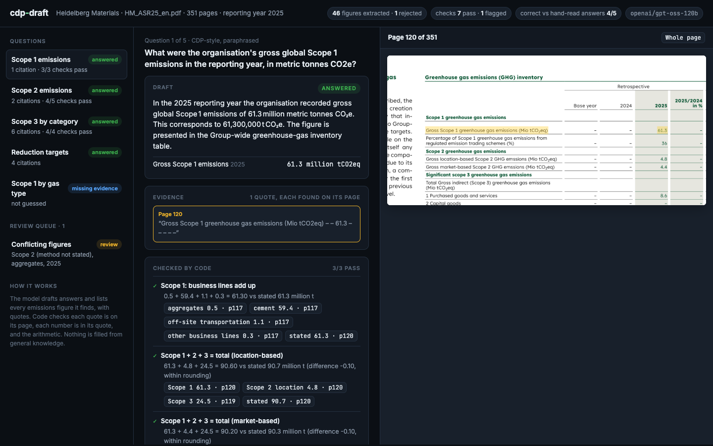
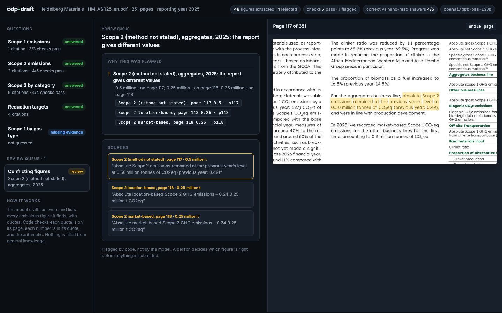
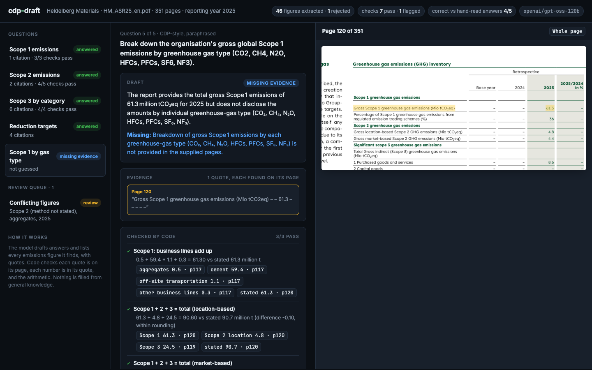

# cdp-draft

Drafts answers to CDP-style climate questions from a company's own sustainability report, with every answer tied to the exact passage it came from. It checks the report's arithmetic in code, and says "missing evidence" instead of guessing.

A one-day prototype, built to understand one piece of the problem Briink works on. It is not their product and uses no data of theirs. The example is Heidelberg Materials' public Annual and Sustainability Report 2025 (351 pages).

## Demo


The clip ([MP4](assets/demo/demo.mp4)) walks through one run: a Scope 2 answer with its quotes highlighted on the page, the arithmetic checks, the one conflict the checks found in the report, the "missing evidence" answer, and the one answer that falls short of the answer read by hand.

| Answer with evidence | Conflict found in the report | Not guessed |
|---|---|---|
|  |  |  |

## What it does

1. **Extracts figures.** The model reads each page that states emissions and lists every absolute figure: scope, business line, year, value, unit, and the exact quote. Page tables are passed with their column headers so years stay attached to numbers.
2. **Validates them in code.** A figure is kept only if its quote is on that page, the number is in the quote, and the unit is a mass of CO2. A failing page is sent back to the model once with the reasons. Then anything still failing is dropped and counted.
3. **Checks the arithmetic.** Business lines must add up to the company figure, Scope 3 categories to Scope 3, and Scope 1 + 2 + 3 to the stated total, within rounding. The same figure stated twice with different values is flagged as a conflict.
4. **Drafts answers.** For each question, keyword search picks three pages and the model drafts an answer with quotes. Code checks every quote and every number the same way. The model can answer `missing_evidence`, and is told to prefer that over estimating.
5. **Scores itself.** `eval/gold.json` holds the right answers, read by hand from the report, and `eval/score.py` compares the drafts against them.
6. **Shows the evidence.** The review UI opens the source page with the quote highlighted, for every answer, figure and flag.

## Result on the example report

One run with `openai/gpt-oss-120b` on Groq:

- 46 absolute emissions figures kept, 1 rejected by validation.
- 7 of 7 arithmetic checks pass within rounding. Examples: Scope 1 business lines 59.4 + 0.5 + 0.3 + 1.1 = 61.3, Scope 3 categories add up to 24.5, and Scope 1 + 2 + 3 comes to 90.2 against a stated 90.3 (market-based).
- 1 conflict flagged for review. Page 117 says the aggregates business line had "absolute Scope 2 emissions" of 0.50 million tonnes (previous year 0.49). The table on the same page gives 0.49 and 0.50 as that line's Scope 1, and page 118 gives its Scope 2 as 0.25 (0.24). The sentence looks like a mislabel. The tool flags it and leaves the call to a person.
- 4 of 5 answers match the answers read by hand. The Scope 1 by gas question is correctly answered "missing evidence", since the report gives CO2e totals only. The miss: the targets answer gives the Scope 1 and 2 targets but leaves out the Scope 3 target on the same page. Everything it states is quoted and correct, but it is incomplete. Code checks that numbers exist on the page. It does not yet check that an answer covers everything the question asks for.

Earlier runs turned up failures that are now caught in code: a Scope 2 figure given a method the text never states, a carbon-pricing figure read as emissions, and a "thereof" subset counted as a whole category. Another failure, years read from the wrong table column, is now prevented by passing the tables with their headers. One earlier run also called 512 kg the 2020 baseline. The number is on the page, but it is the 2025 figure. Code cannot catch that yet.

## Run

```bash
uv venv .venv && uv pip install --python .venv/bin/python -r requirements.txt
# put the report PDF in data/, set GROQ_API_KEY in .env
.venv/bin/python -m cdp_draft.run data/HM_ASR25_en.pdf --year 2025
.venv/bin/python -m eval.score
.venv/bin/uvicorn cdp_draft.server:app --port 8010
```

Model calls are cached in `cache/`, so a rerun replays the same outputs without spending tokens.

## Layout

- `cdp_draft/report.py`: pages, quote matching (compares letters, so PDF hyphenation and non-breaking spaces don't break it), keyword search, highlighted rendering
- `cdp_draft/facts.py`: figure extraction and validation
- `cdp_draft/checks.py`: sums and conflicts
- `cdp_draft/answer.py`: questions, drafting, validation
- `cdp_draft/server.py`, `web/index.html`: review UI
- `eval/`: hand-written answers and scoring
- `tests/`: offline tests for validation, arithmetic and quote matching (`pytest -q`)
- `scripts/record_demo.js`: records the demo clip with headless Chrome

## Limits

- Five questions and one report. The question wording is paraphrased, not CDP's official text.
- Keyword search is enough for a well-structured report. Messier documents would need better retrieval.
- A table figure's year comes from the model reading the column header. Code can't verify that part yet.
- The report PDF is not included. Download it from Heidelberg Materials' investor relations site.
